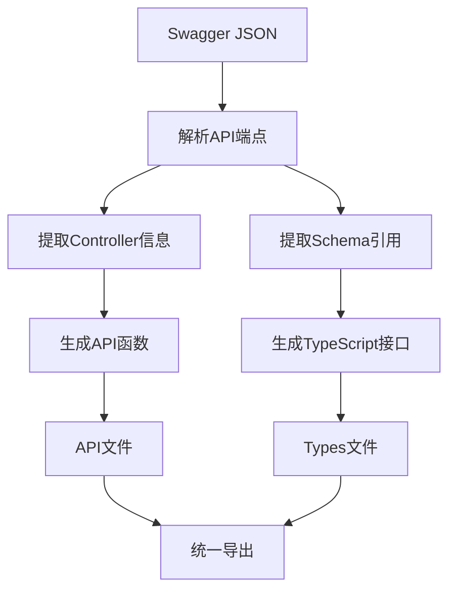

# 基础控制器框架接口说明文档

本文档详细说明了Spring Boot框架中四个基础控制器类的所有接口，这些基础控制器为业务项目提供了通用的CRUD和其他操作功能，可作为快速开发的基础框架。同时提供了完整的前端API和TypeScript类型自动生成机制。

## 目录
1. [基础控制器说明](#基础控制器说明)
   - [BaseAdminController](#baseadmincontroller) - 基础管理控制器
   - [BaseAdminOrderController](#baseadminordercontroller) - 排序管理控制器
   - [BaseAdminTreeController](#baseadmintreecontroller) - 树形结构管理控制器
   - [BaseBindController](#basebindcontroller) - 多对多关系绑定控制器
2. [前端API和Types自动生成](#前端api和types自动生成)
   - [生成机制说明](#生成机制说明)
   - [文件结构](#文件结构)
   - [使用方式](#使用方式)
   - [类型安全开发](#类型安全开发)
3. [开发流程建议](#开发流程建议)

---

## 前端API和Types自动生成

基于基础控制器框架，项目提供了完整的前端API函数和TypeScript类型定义自动生成机制。通过Swagger JSON规范自动解析后端接口，生成对应的TypeScript代码，为前端开发提供完整的类型安全保障。

### 生成机制说明

#### 1. 自动化生成流程



#### 2. 主要功能特性

- **自动API函数生成**：基于Swagger生成具有类型安全的API调用函数
- **TypeScript类型定义**：自动生成所有VO类型的TypeScript接口
- **嵌套类型解析**：自动处理复杂的嵌套对象结构
- **响应类型封装**：基于系统统一返回格式生成响应类型
- **智能函数命名**：自动处理命名冲突，生成语义化函数名

#### 3. 生成命令

```bash
# 在前端项目根目录执行
node src/framework/script/generate-api-v2.cjs
```

该命令会：
1. 获取后端Swagger JSON数据
2. 解析所有API端点和响应Schema
3. 生成API函数文件（`src/apis/`）
4. 生成Types类型文件（`src/apis/types/`）
5. 生成统一导出文件

### 文件结构

自动生成的文件组织结构：

```
src/apis/
├── index.ts                                    # API函数统一导出
├── ...Controller.ts                            # 其他Controller API文件
└── types/                                      # 类型定义目录
    ├── index.ts                                # Types统一导出
    └── ...ControllerTypes.ts                   # 其他类型文件
```

#### 1. API函数文件结构

每个Controller的API文件包含：

```typescript
// evaluationPortalController.ts 示例
import { request } from '@/framework/network/request';
import { buildGetApiByType, buildPostApiByType } from '@/framework/apis';

/**
 * 高级查询数据
 */
export const evaluationAdvancedQuery = (data?: any, showSuccess = true, showLoading = false) => {
  const api = buildPostApiByType('/das/evaluation/advanced/query', '');
  return request(api, {}, data || {}, showSuccess, showLoading);
};

/**
 * 根据id获取详情
 */
export const evaluationQueryById = (params?: object, showSuccess = true, showLoading = false) => {
  const api = buildGetApiByType('/das/evaluation/id', '');
  return request(api, params || {}, {}, showSuccess, showLoading);
};

// ... 其他API函数
```

#### 2. Types类型文件结构

每个Controller的Types文件包含：

```typescript
// evaluationPortalControllerTypes.ts 示例
import { ResponseDataType } from '@/framework/utils/type';

// 基础VO接口
export interface EvaluationVO {
  /** id */
  id?: number;
  /** 名称 */
  title?: string;
  /** 总分 */
  totalScore?: number;
  /** 创建时间 */
  createAt?: string;
  /** 创建人工号 */
  createBy?: string;
  /** 创建人 */
  createName?: string;
  // ... 其他属性
}

// 嵌套类型自动解析
export interface EvaluationRes {
  /** 考试内容组 */
  examContentGroups?: ExamContentGroupVO[];
  /** id */
  id?: number;
  /** 标题 */
  title?: string;
  /** 总分 */
  totalScore?: number;
}

export interface ExamContentGroupVO {
  /** 内容列表 */
  contents?: ContentVO[];
  /** ID */
  id?: number;
  /** 名称 */
  name?: string;
  /** 总分 */
  totalScore?: number;
}

// 响应类型封装
export type EvaluationVOResponse = ResponseDataType & {
  payload: EvaluationVO;
};

export type EvaluationVOListResponse = ResponseDataType & {
  payload: EvaluationVO[];
};

export type EvaluationVOPageResponse = ResponseDataType & {
  payload: {
    list: EvaluationVO[];
    total: number;
    currentPage: number;
    pageSize: number;
  };
};
```

### 使用方式

#### 1. 基本导入和使用

```typescript
// 导入API函数
import { 
  evaluationAdvancedQuery,
  evaluationQueryById,
  evaluationAdd,
  evaluationUpdate,
  evaluationDeleteItem 
} from '@/apis';

// 导入类型定义
import { 
  EvaluationVO,
  EvaluationVOPageResponse,
  EvaluationVOResponse,
  EvaluationRes,
  EvaluationResResponse
} from '@/apis/types';
```

#### 2. 类型安全的API调用

```typescript
// 分页查询试卷列表
async function getEvaluationList(params: {
  currentPage?: number;
  pageSize?: number;
  title?: string;
}): Promise<EvaluationVOPageResponse> {
  const queryParams = {
    currentPage: params.currentPage || 1,
    pageSize: params.pageSize || 10,
    conditionList: params.title ? [{
      property: 'title',
      relation: 8, // LIKE
      value: [params.title]
    }] : []
  };
  
  return await evaluationAdvancedQuery(queryParams);
}

// 根据ID获取试卷详情
async function getEvaluationDetail(id: number): Promise<EvaluationVOResponse> {
  return await evaluationQueryById({ id });
}

// 新增试卷
async function createEvaluation(data: Partial<EvaluationVO>): Promise<EvaluationVOResponse> {
  return await evaluationAdd(data);
}
```

#### 3. Vue组件中的使用示例

```vue
<script setup lang="ts">
import { ref, onMounted } from 'vue';
import { evaluationAdvancedQuery, evaluationDeleteItem } from '@/apis';
import type { EvaluationVO, EvaluationVOPageResponse } from '@/apis/types';

const evaluations = ref<EvaluationVO[]>([]);
const loading = ref(false);
const total = ref(0);

// 加载试卷列表
const loadEvaluations = async () => {
  loading.value = true;
  try {
    const response: EvaluationVOPageResponse = await evaluationAdvancedQuery({
      currentPage: 1,
      pageSize: 10,
      conditionList: []
    });
    
    if (response.status.code === 200) {
      evaluations.value = response.payload.list;
      total.value = response.payload.total;
    }
  } catch (error) {
    console.error('加载试卷列表失败:', error);
  } finally {
    loading.value = false;
  }
};

// 删除试卷
const deleteEvaluation = async (id: number) => {
  try {
    await evaluationDeleteItem({ id });
    await loadEvaluations(); // 重新加载列表
  } catch (error) {
    console.error('删除试卷失败:', error);
  }
};

onMounted(() => {
  loadEvaluations();
});
</script>

<template>
  <div class="evaluation-list">
    <div v-if="loading" class="loading">加载中...</div>
    <div v-else>
      <div 
        v-for="evaluation in evaluations" 
        :key="evaluation.id"
        class="evaluation-item"
      >
        <h3>{{ evaluation.title }}</h3>
        <p>总分: {{ evaluation.totalScore }}</p>
        <p>创建时间: {{ evaluation.createAt }}</p>
        <button @click="deleteEvaluation(evaluation.id!)">删除</button>
      </div>
    </div>
  </div>
</template>
```

### 类型安全开发

#### 1. 类型安全的优势

- **编译时检查**：在编译阶段发现类型错误，避免运行时问题
- **智能提示**：IDE提供完整的属性自动补全和类型提示
- **重构安全**：当后端接口变更时，前端代码会有编译错误提示
- **文档化**：类型定义本身就是最好的API文档
- **团队协作**：团队成员可以快速了解API的输入输出格式

#### 2. 最佳实践建议

**类型使用规范**：
```typescript
// ✅ 推荐：使用具体的VO类型
const processEvaluation = (data: EvaluationVO) => {
  console.log(data.title, data.totalScore);
};

// ❌ 不推荐：使用any类型
const processEvaluation = (data: any) => {
  console.log(data.title, data.totalScore); // 无类型检查
};
```

**类型守卫处理可选属性**：
```typescript
// 处理可选属性
const renderEvaluation = (evaluation: EvaluationVO) => {
  return {
    title: evaluation.title || '未命名试卷',
    score: evaluation.totalScore ?? 0,
    createTime: evaluation.createAt || ''
  };
};
```

**响应数据处理**：
```typescript
// 基于 ResponseDataType.status.code 进行错误判断
const handleApiResponse = async () => {
  const response = await evaluationAdvancedQuery({});
  
  if (response.status.code === 200) {
    // 成功处理
    const evaluations = response.payload.list;
    console.log('获取到', evaluations.length, '条记录');
  } else {
    // 错误处理
    console.error('请求失败:', response.status.msg);
  }
};
```

#### 3. 自动同步机制

当后端接口发生变更时，只需重新运行生成命令：

```bash
node src/framework/script/generate-api-v2.cjs
```

系统会自动：
1. 更新变更的API函数
2. 更新变更的类型定义
3. 添加新的接口和类型
4. 删除废弃的接口和类型

前端TypeScript编译器会立即提示不兼容的代码位置，帮助开发者快速适配变更。

---

## 基础控制器说明

## BaseAdminController

BaseAdminController 是最基础的管理控制器，提供标准的CRUD操作、查询、统计、导入导出等功能。

### 基本CRUD接口

#### 1. 新增操作
- **接口路径**: `POST /insert`
- **API名称**: 添加数据
- **参数**: `@RequestBody VO vo`
- **功能**: 添加单条数据记录
- **事务**: 支持事务回滚

#### 2. 删除操作
- **接口路径**: `POST /delete`
- **API名称**: 删除数据
- **参数**: `@RequestBody IdReqVO vo`
- **功能**: 根据ID删除单条数据
- **事务**: 支持事务回滚

- **接口路径**: `POST /delete/list`
- **API名称**: 删除数据列表
- **参数**: `@RequestBody List<String> idList`
- **功能**: 批量删除多条数据
- **事务**: 支持事务回滚

#### 3. 更新操作
- **接口路径**: `POST /update`
- **API名称**: 更新数据
- **参数**: `@RequestBody VO vo, @RequestParam(required = false) boolean strict`
- **功能**: 更新单条数据，strict参数控制是否更新null值
- **事务**: 支持事务回滚

- **接口路径**: `POST /update/list`
- **API名称**: 更新数据
- **参数**: `@RequestBody List<VO> entityList, @RequestParam(required = false) boolean strict`
- **功能**: 批量更新多条数据
- **事务**: 支持事务回滚

#### 4. 查询操作
- **接口路径**: `GET /id`
- **API名称**: 根据id获取详情
- **参数**: `IdReqVO req`
- **功能**: 根据ID查询单条数据详情

### 高级查询接口

#### 1. 通用查询
- **接口路径**: `POST /general/query`
- **API名称**: 通用查询数据
- **参数**: `@RequestBody QueryConditionReq req`
- **功能**: 基于通用查询条件的分页查询

- **接口路径**: `POST /general/select`
- **API名称**: 通用查询数据(不分页)
- **参数**: `@RequestBody QueryConditionReq req`
- **功能**: 基于通用查询条件的不分页查询

#### 2. 高级查询
- **接口路径**: `POST /advanced/query`
- **API名称**: 高级查询数据
- **参数**: `@RequestBody AdvancedQueryReq req`
- **功能**: 基于高级查询条件的分页查询

- **接口路径**: `POST /advanced/select`
- **API名称**: 高级查询数据(不分页)
- **参数**: `@RequestBody AdvancedQueryReq req`
- **功能**: 基于高级查询条件的不分页查询

### 统计分析接口

#### 1. 计数统计
- **接口路径**: `POST /general/count`
- **API名称**: 个数统计
- **参数**: `@RequestBody QueryConditionReq req`
- **功能**: 基于通用查询条件统计记录数量

- **接口路径**: `POST /advanced/count`
- **API名称**: 统计个数
- **参数**: `@RequestBody AdvancedQueryReq req`
- **功能**: 基于高级查询条件统计记录数量

#### 2. 汇总统计
- **接口路径**: `POST /general/summary`
- **API名称**: 汇总
- **参数**: `@RequestBody GeneralSummaryReq req`
- **功能**: 基于通用条件进行数据汇总

- **接口路径**: `POST /advanced/summary`
- **API名称**: 汇总
- **参数**: `@RequestBody AdvancedSummaryReq req`
- **功能**: 基于高级条件进行数据汇总

#### 3. 指标统计
- **接口路径**: `POST /general/statistic`
- **API名称**: 指标统计
- **参数**: `@RequestBody GeneralStatisticReq req`
- **功能**: 基于通用条件进行指标统计

- **接口路径**: `POST /advanced/statistic`
- **API名称**: 指标统计
- **参数**: `@RequestBody AdvancedStatisticReq req`
- **功能**: 基于高级条件进行指标统计

### 导入导出接口

#### 1. 数据导出
- **接口路径**: `POST /advanced/query/export`
- **API名称**: 数据导出
- **参数**: `@RequestBody AdvancedQueryReq req, @RequestParam(required = false) String name`
- **功能**: 基于查询条件导出数据为Excel/CSV文件
- **特点**: 自动设置分页参数(page=1, size=60000)

- **接口路径**: `GET /template/export`
- **API名称**: 模版导出
- **参数**: `@RequestParam(required = false) String name`
- **功能**: 导出数据模板文件

#### 2. 数据导入
- **接口路径**: `POST /import/add`
- **API名称**: 导入新增
- **参数**: `@RequestParam(required = false) String name, MultipartFile file`
- **功能**: 通过Excel文件导入新增数据

- **接口路径**: `GET /import/add/progress`
- **API名称**: 获取导入新增进度
- **参数**: `@RequestParam(required = false) String name`
- **功能**: 获取导入新增操作的进度状态

- **接口路径**: `POST /import/update`
- **API名称**: 导入修改
- **参数**: `@RequestParam(required = false) String name, MultipartFile file`
- **功能**: 通过Excel文件导入修改数据

- **接口路径**: `GET /import/update/progress`
- **API名称**: 导入修改进度
- **参数**: `@RequestParam(required = false) String name`
- **功能**: 获取导入修改操作的进度状态

---

## BaseAdminOrderController

BaseAdminOrderController 继承自 BaseAdminController，专门处理需要排序功能的实体管理。

### 排序管理接口

#### 1. 更新排序
- **接口路径**: `POST /order/update`
- **API名称**: 变更顺序
- **参数**: `@RequestBody List<IdOrderReqVO> idOrderReqVOList`
- **功能**: 批量更新多条记录的显示顺序
- **事务**: 支持事务回滚
- **特点**: 自动设置更新时间戳

### 抽象方法要求

继承此类的控制器需要实现：
- `SFunction<ENTITY, ?> id()`: 指定实体的ID字段
- `SFunction<ENTITY, Integer> order()`: 指定实体的排序字段

### 自动排序功能

- 新增数据时自动设置排序值（当前记录总数+1）
- 支持在添加前通过 `beforeAdd()` 和 `adminBeforeAdd()` 钩子方法自定义排序逻辑

---

## BaseAdminTreeController

BaseAdminTreeController 继承自 BaseAdminOrderController，专门处理树形结构数据的管理。

### 树形结构查询接口

#### 1. 节点关系查询
- **接口路径**: `GET /tree/parent`
- **API名称**: 获取父节点
- **参数**: `IdReqVO req`
- **功能**: 根据节点ID获取其父节点信息

- **接口路径**: `GET /tree/children`
- **API名称**: 获取子节点列表
- **参数**: `IdReqVO req`
- **功能**: 根据节点ID获取其所有直接子节点

- **接口路径**: `GET /tree/brothers`
- **API名称**: 获取兄弟节点列表
- **参数**: `IdReqVO req`
- **功能**: 根据节点ID获取其同级兄弟节点

#### 2. 树形数据获取
- **接口路径**: `GET /tree/data`
- **API名称**: 获取树形数据
- **功能**: 获取完整的树形结构数据
- **返回**: TreeDataResVO格式的树形数据

- **接口路径**: `POST /advanced/tree/data`
- **API名称**: 高级查询树形数据
- **参数**: `@RequestBody AdvancedQueryReq req`
- **功能**: 基于高级查询条件获取树形结构数据
- **特点**: 自动设置分页参数(page=1, size=60000)

### 树形结构操作接口

#### 1. 父节点变更
- **接口路径**: `POST /pid`
- **API名称**: 变更父节点
- **参数**: `@RequestBody IdPidReqVO req`
- **功能**: 修改节点的父节点关系
- **事务**: 支持事务回滚

### 抽象方法要求

继承此类的控制器需要实现：
- `SFunction<ENTITY, ?> pid()`: 指定实体的父ID字段
- `SFunction<ENTITY, String> name()`: 指定实体的名称字段
- 继承自父类的 `id()` 和 `order()` 方法

### 自动排序功能

- 支持按父节点分组的自动排序
- 新增节点时自动设置在同级节点中的排序位置

---

## BaseBindController

BaseBindController 专门处理实体间的绑定关系管理，如用户角色绑定、菜单权限绑定等多对多关系。

### 绑定关系查询接口

#### 1. 已绑定查询
- **接口路径**: `GET /bind/list`
- **API名称**: 获取已绑定(列表)
- **参数**: `String entityId`
- **功能**: 获取指定实体的所有已绑定关联实体列表

- **接口路径**: `POST /bind/query`
- **API名称**: 获取已绑定(分页)
- **参数**: `@RequestBody QueryBindReq req`
- **功能**: 分页查询已绑定的关联实体

- **接口路径**: `POST /bind/advanced/query`
- **API名称**: 获取已绑定(分页)
- **参数**: `@RequestBody AdvancedQueryBindReq req`
- **功能**: 基于高级查询条件分页查询已绑定实体

#### 2. 未绑定查询
- **接口路径**: `POST /unbind/query`
- **API名称**: 获取未绑定
- **参数**: `@RequestBody QueryBindReq req`
- **功能**: 分页查询未绑定的关联实体

- **接口路径**: `POST /unbind/advanced/query`
- **API名称**: 获取未绑定
- **参数**: `@RequestBody AdvancedQueryBindReq req`
- **功能**: 基于高级查询条件分页查询未绑定实体

#### 3. 关联实体查询
- **接口路径**: `POST /bind/attach/query`
- **API名称**: 查询绑定实体(分页)
- **参数**: `@RequestBody QueryBindReq req`
- **功能**: 查询可用于绑定的实体列表

- **接口路径**: `POST /attach/advanced/query`
- **API名称**: 查询绑定实体(分页)
- **参数**: `@RequestBody AdvancedQueryBindReq req`
- **功能**: 基于高级查询条件查询可绑定实体

### 绑定操作接口

#### 1. 基本绑定操作
- **接口路径**: `POST /bind`
- **API名称**: 绑定
- **参数**: `@RequestBody BindReq req`
- **功能**: 绑定单个实体关系

- **接口路径**: `POST /bind/batch`
- **API名称**: 批量绑定
- **参数**: `@RequestBody BindListReq req`
- **功能**: 批量绑定多个实体关系

- **接口路径**: `POST /bind/all`
- **API名称**: 全量绑定
- **参数**: `@RequestBody AdvancedQueryBindReq req`
- **功能**: 基于查询条件绑定所有匹配的实体
- **特点**: 自动设置分页参数(page=1, size=60000)

#### 2. 解绑操作
- **接口路径**: `POST /unbind`
- **API名称**: 解绑
- **参数**: `@RequestBody BindReq req`
- **功能**: 解除单个实体绑定关系

- **接口路径**: `POST /unbind/batch`
- **API名称**: 批量解绑
- **参数**: `@RequestBody BindListReq req`
- **功能**: 批量解除多个实体绑定关系

- **接口路径**: `POST /unbind/all`
- **API名称**: 全量解绑
- **参数**: `@RequestBody BindBaseReq req`
- **功能**: 解除指定实体的所有绑定关系

#### 3. 替换绑定操作
- **接口路径**: `POST /replace`
- **API名称**: 替换绑定
- **参数**: `@RequestBody BindListReq req`
- **功能**: 替换实体的所有绑定关系（先解绑所有，再绑定新的）

- **接口路径**: `POST /advanced/replace`
- **API名称**: 替换绑定
- **参数**: `@RequestBody AdvancedQueryBindReq req`
- **功能**: 基于查询条件替换绑定关系
- **特点**: 自动设置分页参数(page=1, size=60000)

### 绑定信息管理接口

#### 1. 绑定信息修改
- **接口路径**: `POST /bind/info`
- **API名称**: 修改绑定信息
- **参数**: `@RequestBody BindInfoReq req, @RequestParam Object entityId, @RequestParam(required = false) boolean strict`
- **功能**: 修改绑定关系的额外信息数据

- **接口路径**: `POST /bind/info/list`
- **API名称**: 修改绑定信息(列表)
- **参数**: `@RequestBody List<BindInfoReq> req, @RequestParam Object entityId, @RequestParam(required = false) boolean strict`
- **功能**: 批量修改绑定关系的额外信息数据

---

## 通用特性说明

### 1. 权限控制
- 所有控制器都支持基于Portal的权限控制
- BaseBindController特别支持admin权限检查和查询前置处理

### 2. 事务管理
- 所有写操作（增删改）都自动支持事务回滚
- 异常类型：`Exception.class`（回滚），`NoticeException.class`（不回滚）

### 3. 响应格式
- 所有接口都使用统一的响应格式 `Resp`
- 分页查询返回 `Page<VO>` 格式
- 列表查询返回 `List<VO>` 格式

### 4. 参数验证
- 支持 `@Validated` 注解进行参数验证
- 关键操作都包含空值检查和业务逻辑验证

### 5. 泛型支持
- 通过泛型实现类型安全
- 自动推断实体类和VO类的类型信息

---

## 使用建议

### 1. 选择合适的基础控制器
- **普通CRUD**: 继承 `BaseAdminController`
- **需要排序**: 继承 `BaseAdminOrderController`
- **树形结构**: 继承 `BaseAdminTreeController`
- **多对多关系**: 继承 `BaseBindController`

### 2. 实现必要的抽象方法
- 根据选择的基础控制器实现对应的抽象方法
- 提供正确的字段映射函数

### 3. 覆盖钩子方法
- 利用 `beforeAdd()`, `adminBeforeAdd()` 等钩子方法实现自定义逻辑
- 在 `beforeQuery()` 中实现权限控制和数据过滤

### 4. 配置Service依赖
- 实现 `getPortalService()` 方法返回对应的业务服务
- 对于绑定控制器，实现 `getAttachPortalService()` 和 `attachAdminController()`

### 5. API文档注解
- 在继承类中添加 `@Api` 注解描述模块功能
- 使用 `@ApiOperation` 为特殊接口添加详细说明

---

## VO（视图对象）文件说明

### VO文件的重要性

VO（Value Object）文件是连接前后端数据交互的关键桥梁，在基础控制器中扮演重要角色：

#### 1. 数据传输载体
- **查询返回**: 所有查询接口（如 `queryById`, `generalQuery`, `advancedQuery`）的返回数据都使用VO格式
- **新增请求**: `POST /insert` 接口的请求体使用VO格式
- **更新请求**: `POST /update` 和 `POST /update/list` 接口的请求体使用VO格式
- **前端适配**: VO字段命名和类型必须与前端字段保持一致

#### 2. VO文件结构规范

```
@Data
@EqualsAndHashCode(callSuper = true)
public class ExampleVO extends BaseVO {
    @PortalIdField
    @ApiModelProperty(value = "id")
    private Long id;
    
    @PortalNameField
    @ApiModelProperty(value = "名称")
    private String title;
    
    @PortalOrderField
    @ApiModelProperty(value = "顺序")
    private Integer displayOrder;
    
    @PortalTextAreaField
    @ApiModelProperty(value = "备注")
    private String remark;
    
    // 其他业务字段...
}
```

#### 3. 关键注解说明

| 注解 | 作用 | 前端影响 |
|------|------|----------|
| `@PortalIdField` | 标识主键字段 | 自动隐藏在表单中，用于数据标识 |
| `@PortalNameField` | 标识名称字段 | 作为主要显示字段，通常显示在列表首列 |
| `@PortalOrderField` | 标识排序字段 | 支持拖拽排序功能 |
| `@PortalTextAreaField` | 标识文本域字段 | 前端渲染为多行文本输入框 |
| `@ApiModelProperty` | API文档说明 | 生成前端接口类型定义的字段注释 |

#### 4. BaseVO继承

所有业务VO都应继承 `BaseVO`，获得以下标准字段：
- `createAt`: 创建时间
- `createBy`: 创建人工号  
- `createName`: 创建人姓名
- `updateAt`: 更新时间
- `updateBy`: 更新人工号
- `updateName`: 更新人姓名
- `valid`: 有效性标识

#### 5. 查找VO文件的方法

在Controller类中查找对应的VO文件：

```
// 示例：继承BaseAdminController
public class BusinessController extends BaseAdminController<Entity, EntityVO> {
    //                                                                ^^^^^^^^^
    //                                                                这里就是VO类型
}
```

1. **泛型参数**: 基础控制器的第二个泛型参数就是对应的VO类
2. **命名规范**: VO文件通常命名为 `实体名称 + VO.java`
3. **包路径**: VO文件通常放在 `vo` 包下，按模块分组

#### 6. 前端字段适配要求

- **字段名**: VO中的字段名必须与前端期望的字段名一致
- **数据类型**: Java类型要能正确映射到TypeScript类型
- **时间格式**: 使用 `@JsonFormat` 注解统一时间格式
- **枚举字典**: 通过 `@PortalDictField` 注解关联字典值

---

## 前端API生成说明

### API生成机制

项目使用 `generate-api-v2.cjs` 脚本自动化生成前端API调用代码，该脚本基于后端Swagger JSON规范生成TypeScript接口函数。

#### 1. 生成策略变更

**最新生成策略** (2025年10月更新)：
- **按Controller分文件**: 根据Swagger Tags的description生成独立的控制器文件
- **智能函数命名**: 移除冗余的 `UsingPOST/UsingGET` 后缀，保持简洁的函数名
- **业务前缀机制**: 为通用接口（如 `advancedQuery`, `delete` 等）添加控制器前缀避免命名冲突
- **语义化后缀**: 当函数名重复时，基于API路径生成有意义的后缀（如 `Batch`、`Query`、`List`），避免数字后缀
- **路径清理**: 自动移除API路径中的项目前缀（如 `/das-api/web`）
- **系统接口过滤**: 自动忽略以"系统"开头的管理接口
- **保留关键字处理**: 自动避免JavaScript保留关键字（如 `delete` → `deleteItem`）

#### 2. 生成的文件结构

```
src/apis/
├── index.ts                           // 统一导出所有API
├── businessPortalController.ts        // 业务管理相关API
├── modulePortalController.ts          // 模块管理相关API
├── entityRelationBindController.ts    // 实体关系绑定API
└── ...
```

#### 3. 函数命名规范

**通用接口命名**（自动添加控制器前缀）：
```javascript
// BaseAdminController 通用接口
businessAdvancedQuery()      // 业务高级查询
moduleAdvancedQuery()        // 模块高级查询
businessAdd()                // 业务新增
moduleAdd()                  // 模块新增
businessDeleteItem()         // 业务删除数据
moduleDeleteItem()           // 模块删除数据

// BaseBindController 绑定接口
entityRelationBind()         // 实体关系绑定
moduleBind()                 // 模块绑定
entityRelationBindBatch()    // 实体关系批量绑定
entityRelationGetBindQuery() // 实体关系查询已绑定
entityRelationUnbindBatch()  // 实体关系批量解绑
```

**特殊业务接口命名**（保持原有语义）：
```javascript
getBusinessData()            // 获取业务数据
saveBusinessContent()        // 保存业务内容
getTreeData()                // 获取树形数据
```

**语义化后缀规则**（新增）：
当函数名重复时，会根据API路径自动添加有意义的后缀：

| 路径模式 | 后缀 | 示例函数名 |
|----------|------|----------|
| `/bind/batch` | `Batch` | `entityRelationBindBatch()` |
| `/bind/query` | `Query` | `entityRelationGetBindQuery()` |
| `/bind/list` | `List` | `entityRelationGetBindList()` |
| `/bind/info` | `Info` | `entityRelationBindInfo()` |
| `/bind/attach/query` | `Attach` | `entityRelationGetAttachAttach()` |
| `/advanced/query` | `Advanced` | `businessAdvancedQuery()` |
| `/general/query` | `General` | `businessGeneralQuery()` |
| `/import/add` | `Import` | `businessImportAdd()` |
| `/template/export` | `Template` | `businessTemplateExport()` |
| `/delete/list` | `List` | `businessDeleteList()` |
| `/update/list` | `List` | `businessUpdateList()` |

#### 4. 接口函数结构

每个生成的API函数都遵循统一的结构：

```
/**
 * 接口功能描述
 */
export const functionName = (
  // 路径参数（如有）
  pathParam?: string | number,
  // 查询参数（如有）
  params?: object,
  // 请求体（如有）
  data?: any,
  // 统一参数
  showSuccess = true,
  showLoading = false
) => {
  const api = buildGetApiByType('/clean/path', '');
  return request(api, params || {}, data || {}, showSuccess, showLoading);
};
```

#### 5. 基础控制器接口映射

**BaseAdminController 标准接口**：

| 后端接口路径 | 前端函数名 | 功能说明 |
|------------|-----------|----------|
| `POST /insert` | `{prefix}Add()` | 新增数据 |
| `POST /delete` | `{prefix}DeleteItem()` | 删除单条 |
| `POST /delete/list` | `{prefix}DeleteList()` | 批量删除 |
| `POST /update` | `{prefix}Update()` | 更新数据 |
| `POST /update/list` | `{prefix}UpdateList()` | 批量更新 |
| `GET /id` | `{prefix}QueryById()` | ID查询 |
| `POST /general/query` | `{prefix}GeneralQuery()` | 通用查询 |
| `POST /general/select` | `{prefix}GeneralSelect()` | 通用查询(不分页) |
| `POST /advanced/query` | `{prefix}AdvancedQuery()` | 高级查询 |
| `POST /advanced/select` | `{prefix}AdvancedSelect()` | 高级查询(不分页) |
| `POST /general/count` | `{prefix}GeneralCount()` | 计数统计 |
| `POST /advanced/count` | `{prefix}AdvancedCount()` | 高级计数统计 |
| `POST /general/summary` | `{prefix}GeneralSummary()` | 数据汇总 |
| `POST /advanced/summary` | `{prefix}AdvancedSummary()` | 高级数据汇总 |
| `POST /general/statistic` | `{prefix}GeneralStatistic()` | 指标统计 |
| `POST /advanced/statistic` | `{prefix}AdvancedStatistic()` | 高级指标统计 |
| `POST /advanced/query/export` | `{prefix}AdvancedQueryExport()` | 数据导出 |
| `GET /template/export` | `{prefix}TemplateExport()` | 模板导出 |
| `POST /import/add` | `{prefix}ImportAdd()` | 导入新增 |
| `GET /import/add/progress` | `{prefix}ImportAddProgress()` | 导入新增进度 |
| `POST /import/update` | `{prefix}ImportUpdate()` | 导入修改 |
| `GET /import/update/progress` | `{prefix}ImportUpdateProgress()` | 导入修改进度 |

**BaseBindController 绑定接口**：

| 后端接口路径 | 前端函数名 | 功能说明 |
|------------|-----------|----------|
| `GET /bind/list` | `{prefix}GetBindList()` | 已绑定列表 |
| `POST /bind/query` | `{prefix}GetBindQuery()` | 已绑定分页查询 |
| `POST /bind/advanced/query` | `{prefix}GetBind()` | 已绑定高级查询 |
| `POST /bind` | `{prefix}Bind()` | 单个绑定 |
| `POST /bind/batch` | `{prefix}BindBatch()` | 批量绑定 |
| `POST /bind/all` | `{prefix}BindAllByCondition()` | 全量绑定 |
| `POST /unbind` | `{prefix}Unbind()` | 单个解绑 |
| `POST /unbind/batch` | `{prefix}UnbindBatch()` | 批量解绑 |
| `POST /unbind/all` | `{prefix}UnbindAll()` | 全量解绑 |
| `POST /replace` | `{prefix}Replace()` | 替换绑定 |
| `POST /advanced/replace` | `{prefix}ReplaceByAdvancedCondition()` | 高级替换绑定 |
| `POST /bind/info` | `{prefix}BindInfo()` | 修改绑定信息 |
| `POST /bind/info/list` | `{prefix}BindInfoList()` | 修改绑定信息列表 |
| `POST /bind/attach/query` | `{prefix}GetAttachAttach()` | 查询绑定实体(附加) |
| `POST /attach/advanced/query` | `{prefix}GetAttach()` | 查询绑定实体(高级) |
| `POST /unbind/query` | `{prefix}GetUnBindQuery()` | 获取未绑定(查询) |
| `POST /unbind/advanced/query` | `{prefix}GetUnBind()` | 获取未绑定(高级) |

**BaseAdminTreeController 树形接口**：

| 后端接口路径 | 前端函数名 | 功能说明 |
|------------|-----------|----------|
| `GET /tree/data` | `{prefix}GetTreeData()` | 获取树形数据 |
| `POST /advanced/tree/data` | `{prefix}GetTreeDataAdvanced()` | 高级树形数据 |
| `GET /tree/parent` | `{prefix}GetParent()` | 获取父节点 |
| `GET /tree/children` | `{prefix}GetChildren()` | 获取子节点 |
| `GET /tree/brothers` | `{prefix}GetBrothers()` | 获取兄弟节点 |
| `POST /pid` | `{prefix}UpdatePid()` | 变更父节点 |

**BaseAdminOrderController 排序接口**：

| 后端接口路径 | 前端函数名 | 功能说明 |
|------------|-----------|----------|
| `POST /order/update` | `{prefix}UpdateOrder()` | 更新排序 |

### API使用规范

#### 1. 统一导入方式

```
// ✅ 推荐：统一从 @/apis 导入
import { 
  businessAdvancedQuery,
  businessAdd,
  businessDeleteItem,  // 注意：已避免 delete 关键字
  entityRelationBind,
  entityRelationBindBatch,  // 注意：使用 Batch 后缀而非数字
  entityRelationGetBindQuery  // 注意：使用 Query 后缀区分不同查询
} from '@/apis';

// ❌ 不推荐：直接导入具体文件
import { businessAdvancedQuery } from '@/apis/businessPortalController';
```

#### 2. 函数调用示例

```
// 基础查询调用
const queryData = async () => {
  const result = await businessAdvancedQuery({
    currentPage: 1,
    pageSize: 10
  });
  return result;
};

// 绑定操作调用 - 使用语义化后缀
const bindEntity = async (entityId: number, attachIds: number[]) => {
  // 单个绑定
  await entityRelationBind({
    entityId: entityId,
    attachId: attachIds[0]
  });
  
  // 批量绑定 - 使用 Batch 后缀
  await entityRelationBindBatch({
    entityId: entityId,
    attachIds: attachIds
  });
};

// 查询操作 - 使用不同后缀区分功能
const queryBindData = async (entityId: number) => {
  // 获取已绑定列表
  const bindList = await entityRelationGetBindList({ entityId });
  
  // 获取已绑定分页查询
  const bindQuery = await entityRelationGetBindQuery({
    entityId,
    currentPage: 1,
    pageSize: 10
  });
  
  return { bindList, bindQuery };
};

// 带路径参数的调用
const getDetail = async (id: number) => {
  const result = await businessQueryById({ id });
  return result;
};

// 删除操作 - 避免 delete 关键字
const deleteEntity = async (id: number) => {
  // 单个删除
  await businessDeleteItem({ id });
  
  // 批量删除 - 使用 List 后缀
  await businessDeleteList({ ids: [id] });
};
```

#### 3. 控制器前缀映射表

| 控制器类型 | 前缀规则 | 示例函数 |
|----------|------|----------|
| `BusinessPortalController` | `business` | `businessAdd()` |
| `ModulePortalController` | `module` | `moduleAdvancedQuery()` |
| `CategoryPortalController` | `category` | `categoryAdd()` |
| `ItemPortalController` | `item` | `itemAdd()` |
| `UserPortalController` | `user` | `userAdd()` |
| `EntityRelationBindController` | `entityRelation` | `entityRelationBind()` |
| `ModuleUserBindController` | `moduleUser` | `moduleUserBind()` |
| `CategoryItemBindController` | `categoryItem` | `categoryItemBind()` |

### 重新生成API

当后端接口发生变更时，使用以下命令重新生成前端API：

```
# 在前端项目根目录执行
node src/framework/script/generate-api-v2.cjs
```

生成完成后会在控制台显示详细的统计信息和使用说明。

---

## 开发流程建议

### 1. 创建新的业务控制器时
1. **设计VO文件**: 根据前端需求设计字段结构
2. **添加Portal注解**: 为关键字段添加适当的Portal注解
3. **继承BaseVO**: 获得标准的审计字段
4. **选择基础控制器**: 根据业务需求选择合适的基础控制器
5. **实现泛型参数**: 正确指定Entity和VO类型

### 2. 前后端对接时
1. **检查VO字段**: 确保VO字段与前端期望一致
2. **验证数据类型**: 确认类型映射正确
3. **测试接口**: 验证生成的前端API是否正常工作
4. **更新文档**: 及时更新API文档

---

## 查询条件编写规范

#### 1. 查询条件类型定义

在Portal组件框架中，查询条件使用标准的 `ConditionListType` 和 `FILTER_TYPE` 枚举来构建：

```typescript
// 查询条件接口定义
interface ConditionListType {
    id?: number
    property?: string | null          // 字段名
    value?: Array<any> | null         // 查询值（数组格式）
    relation?: number | string | null // 关系类型（对应FILTER_TYPE）
    conditionList: Array<ConditionListType>  // 嵌套条件列表
    andOr?: string                    // 条件关系：'0'=AND, '1'=OR
    isShow?: boolean
}

// 过滤器类型枚举
enum FILTER_TYPE {
  EQUAL = 1,           // 等于
  NOT_EQUAL,           // 不等于
  GREATER,             // 大于
  GREATER_EQUAL,       // 大于等于
  LESS,                // 小于
  LESS_EQUAL,          // 小于等于
  NULL,                // 为空
  NOT_NULL,            // 不为空
  LIKE,                // 模糊匹配
  NOT_LIKE,            // 不匹配
  IN,                  // 包含
  NOT_IN,              // 不包含
  BETWEEN,             // 区间
  NOT_BETWEEN,         // 不在区间
  CONTAIN,             // 包含
  CONTAIN_IN_OR,       // 包含其中之一
  CONTAIN_IN_AND,      // 包含全部
  SELECT_APPLY = 99    // 特殊查询应用
}
```

#### 2. 条件构建工具函数

框架提供了 `buildCondition` 工具函数简化条件构建：

```typescript
import { buildCondition } from '@/framework/components/common/Portal/utils'
import { FILTER_TYPE } from '@/framework/components/common/Portal/type'

// 构建单个条件
const condition = buildCondition(
  'fieldName',           // 字段名
  FILTER_TYPE.EQUAL,     // 关系类型
  ['value1', 'value2']   // 查询值数组
)
```

#### 3. 常用查询条件示例

**等值查询**：
```typescript
// 查询状态为'1'的记录
const statusCondition = {
  conditionList: [{
    property: 'status',
    relation: FILTER_TYPE.EQUAL,
    value: ['1']
  }]
}
```

**范围查询**：
```typescript
// 查询创建时间在指定范围内的记录
const dateRangeCondition = {
  conditionList: [{
    property: 'createAt',
    relation: FILTER_TYPE.BETWEEN,
    value: ['2024-01-01', '2024-12-31']
  }]
}
```

**模糊搜索**：
```typescript
// 名称包含关键字的记录
const nameSearchCondition = {
  conditionList: [{
    property: 'name',
    relation: FILTER_TYPE.LIKE,
    value: ['关键字']
  }]
}
```

**多条件组合**：
```typescript
// 组合条件：状态为'1' AND 类型在指定列表中
const combinedCondition = {
  andOr: '0', // AND关系
  conditionList: [
    {
      property: 'status',
      relation: FILTER_TYPE.EQUAL,
      value: ['1']
    },
    {
      property: 'type',
      relation: FILTER_TYPE.IN,
      value: ['type1', 'type2', 'type3']
    }
  ]
}
```

**嵌套条件**：
```typescript
// 复杂嵌套：(状态='1' OR 状态='2') AND 类型='active'
const nestedCondition = {
  andOr: '0', // 顶层AND
  conditionList: [
    {
      andOr: '1', // 内层OR
      conditionList: [
        {
          property: 'status',
          relation: FILTER_TYPE.EQUAL,
          value: ['1']
        },
        {
          property: 'status',
          relation: FILTER_TYPE.EQUAL,
          value: ['2']
        }
      ]
    },
    {
      property: 'type',
      relation: FILTER_TYPE.EQUAL,
      value: ['active']
    }
  ]
}
```

#### 4. Portal组件中的应用

**基础用法**：
```vue
<template>
  <portal 
    :advance-condition="queryCondition"
    table-id="BusinessEntity" />
</template>

<script setup>
import { computed } from 'vue'
import { buildCondition } from '@/framework/components/common/Portal/utils'
import { FILTER_TYPE } from '@/framework/components/common/Portal/type'

const selectedCategory = ref('category1')

// 动态条件
const queryCondition = computed(() => {
  return {
    conditionList: [
      buildCondition('category', FILTER_TYPE.EQUAL, [selectedCategory.value])
    ]
  }
})
</script>
```

**复杂查询场景**：
```vue
<script setup>
// 多重筛选条件
const advancedCondition = computed(() => {
  const conditions = []
  
  // 基础状态筛选
  if (searchForm.status) {
    conditions.push(
      buildCondition('status', FILTER_TYPE.EQUAL, [searchForm.status])
    )
  }
  
  // 时间范围筛选
  if (searchForm.dateRange?.length === 2) {
    conditions.push(
      buildCondition('createAt', FILTER_TYPE.BETWEEN, searchForm.dateRange)
    )
  }
  
  // 关键字搜索
  if (searchForm.keyword) {
    conditions.push(
      buildCondition('name', FILTER_TYPE.LIKE, [searchForm.keyword])
    )
  }
  
  return { conditionList: conditions }
})
</script>
```

#### 5. 查询条件最佳实践

1. **字段类型匹配**：确保查询值类型与数据库字段类型一致
2. **数组格式**：所有查询值都使用数组格式，即使是单个值
3. **空值处理**：使用 `NULL` 和 `NOT_NULL` 类型处理空值查询
4. **性能优化**：避免过于复杂的嵌套条件，考虑数据库索引
5. **动态条件**：使用 `computed` 响应式构建条件，支持实时筛选

#### 6. 与后端接口对应关系

前端构建的查询条件会自动转换为后端接口参数：
- **generalQuery**: 对应 `QueryConditionReq` 参数
- **advancedQuery**: 对应 `AdvancedQueryReq` 参数
- **count统计**: 对应 `GeneralSummaryReq` 等统计类参数

后端会自动解析这些条件并生成相应的SQL查询语句。

---


*本文档描述了通用的基础控制器框架，包含了完整的接口规范、VO设计规范和前端API生成机制。该框架可应用于各种Spring Boot项目，提供标准化的CRUD操作、数据绑定、树形结构管理等功能。建议在新项目开发时参考此文档，充分利用框架提供的基础功能。*

## 项目特色亮点

### 1. 全自动化开发流程
- **后端开发**：继承基础控制器，实现最少代码编写
- **前端开发**：自动生成API函数和TypeScript类型，无需手动维护
- **类型安全**：编译时发现问题，避免运行时错误
- **自动同步**：后端接口变更后，前端类型自动更新

### 2. 企业级开发标准
- **统一数据格式**：所有接口都遵循ResponseDataType格式
- **权限控制**：内置Portal权限系统支持
- **事务管理**：所有写操作自动支持事务回滚
- **性能优化**：内置分页、缓存、索引优化

### 3. 多种业务场景支持
- **BaseAdminController**：适用于90%的普通CRUD场景
- **BaseBindController**：专门处理多对多关系绑定
- **BaseAdminTreeController**：完美支持树形结构数据
- **BaseAdminOrderController**：内置排序功能支持

### 4. 开发效率提升
- **代码量减少**：相比传统开发减少迕70%代码量
- **开发时间**：常规CRUD功能5分钟即可完成
- **错误率**：类型安全和自动生成减少人为错误
- **维护成本**：接口变更时自动同步，无需手动维护

### 5. 团队协作优势
- **标准化**：统一的代码风格和结构
- **文档化**：类型定义即文档，自动生成注释
- **学习成本**：新人快速上手，减少培训成本
- **代码审查**：统一模式便于代码审查和质量控制

## 使用场景推荐

### 1. 适合的项目类型
- **企业管理系统**：内部OA、ERP、CRM等管理系统
- **互联网平台**：内容管理、用户管理、订单管理等
- **微服务架构**：多个微服务需要统一的CRUD接口
- **快速原型**：需要快速验证业务逻辑的原型项目

### 2. 技术栈要求
- **后端**：Spring Boot 2.x+、MyBatis-Plus、MySQL/PostgreSQL
- **前端**：Vue 3.x+、TypeScript、Vite、Element Plus/Ant Design Vue
- **工具**：Swagger/OpenAPI 3.0、Node.js 16+

### 3. 不适合的场景
- 复杂的数据关系需要大量自定义SQL
- 对性能有极限要求的高并发系统
- 需要大量非标准化接口的特殊项目

## 开始使用

### 1. 第一次使用

1. **后端开发**
```java
// 创建 VO 类
@Data
@EqualsAndHashCode(callSuper = true)
public class ProductVO extends BaseVO {
    @PortalIdField
    private Long id;
    
    @PortalNameField
    private String name;
    
    private BigDecimal price;
    // ... 其他属性
}

// 创建 Controller
@RestController
@RequestMapping("/product")
public class ProductController extends BaseAdminController<Product, ProductVO> {
    // 无需编写任何代码，继承即获得全部CRUD功能
}
```

2. **生成前端API和Types**
```bash
node src/framework/script/generate-api-v2.cjs
```

3. **前端使用**
```typescript
import { productAdvancedQuery, productAdd } from '@/apis';
import { ProductVO, ProductVOPageResponse } from '@/apis/types';

const getProducts = async (): Promise<ProductVOPageResponse> => {
  return await productAdvancedQuery({
    currentPage: 1,
    pageSize: 10
  });
};
```

### 2. 日常开发流程

1. **后端变更**：修改VO或增加新接口
2. **重新生成**：运行`generate-api-v2.cjs`脚本
3. **前端适配**：TypeScript编译器会提示需要修改的代码
4. **测试验证**：确保功能正常

## 最后的话

这个基础控制器框架和自动化生成系统是为了解决现代Web开发中的一些常见痛点：

- **重复劳动**：CRUD代码的重复编写
- **类型不安全**：前后端类型不一致导致的错误
- **接口文档**：手动维护文档的高成本
- **前后端协作**：接口变更时的沟通成本

通过这个框架，我们希望能让开发者更加专注于业务逻辑，而不是基础的CRUD操作。同时，通过类型安全和自动化生成，提高代码质量和开发效率。

希望这个文档能帮助你快速上手和高效使用这个框架！