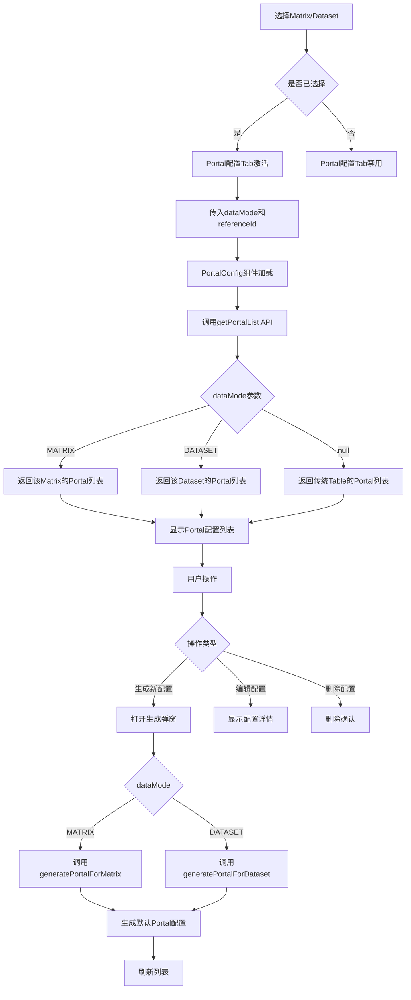

# Portal配置组件复用说明

## 概述

本文档说明如何将Portal配置页面改造为通用组件，使其能够同时支持传统表格（Table）、矩阵（Matrix）和数据集（Dataset）三种数据模式的Portal配置管理。

## 改造目标

1. **传统模式（dataMode = null）**: 管理所有基于后端Controller生成的Portal配置
2. **Matrix模式（dataMode = 'MATRIX'）**: 管理指定Matrix的Portal配置
3. **Dataset模式（dataMode = 'DATASET'）**: 管理指定Dataset的Portal配置

## 核心改造点

### 1. 组件Props扩展

在 `PortalConfig/index.vue` 中添加props定义：

```typescript
const props = withDefaults(
  defineProps<{
    // 数据模式: null=传统表格, MATRIX=矩阵, DATASET=数据集
    dataMode?: string | null
    // 关联ID: matrixId 或 datasetId
    referenceId?: number | null
  }>(),
  {
    dataMode: null,
    referenceId: null
  }
)
```

### 2. API接口扩展

**文件**: `src/framework/apis/portal/config.ts`

#### 修改前
```typescript
export const getPortalList = (name: string, roleId: any) => 
  get(buildGetApi('/list'), { name, roleId }, {}, false, false)

export const getPortalConfig = (name: string, roleId?: any) => 
  get(buildGetApi('/config'), { name, roleId }, {}, false, false)
```

#### 修改后
```typescript
export const getPortalList = (
  name: string, 
  roleId: any, 
  dataMode?: string, 
  referenceId?: any
) => 
  get(buildGetApi('/list'), { 
    name, 
    roleId, 
    dataMode, 
    referenceId 
  }, {}, false, false)

export const getPortalConfig = (
  name: string, 
  roleId?: any, 
  dataMode?: string, 
  referenceId?: any
) => 
  get(buildGetApi('/config'), { 
    name, 
    roleId, 
    dataMode, 
    referenceId 
  }, {}, false, false)
```

**说明**: 添加dataMode和referenceId参数，后端根据这些参数筛选返回对应的Portal配置列表。

### 3. 生成Portal配置功能

#### 新增UI组件

在左侧列表底部添加"生成Portal配置"按钮（仅在Matrix/Dataset模式显示）：

```vue
<a-button
  v-if="props.dataMode && props.referenceId"
  type="primary"
  shape="round"
  @click="showGenerateModal = true"
>
  生成Portal配置
  <template #icon>
    <PlusOutlined />
  </template>
</a-button>
```

#### 生成弹窗

```vue
<a-modal
  v-model:open="showGenerateModal"
  title="生成Portal配置"
  centered
  @ok="handleGeneratePortal"
>
  <a-form>
    <a-form-item label="Portal名称" name="portalName">
      <a-input v-model:value="generateForm.portalName" />
    </a-form-item>
    <a-form-item label="显示名称" name="displayName">
      <a-input v-model:value="generateForm.displayName" />
    </a-form-item>
  </a-form>
</a-modal>
```

#### 生成逻辑

```typescript
const handleGeneratePortal = async () => {
  try {
    await generateFormRef.value?.validate()
    
    const params = {
      dataMode: props.dataMode!,
      portalName: generateForm.portalName,
      displayName: generateForm.displayName
    }
    
    if (props.dataMode === 'MATRIX') {
      await generatePortalForMatrix({
        ...params,
        matrixId: props.referenceId!
      })
    } else if (props.dataMode === 'DATASET') {
      await generatePortalForDataset({
        ...params,
        datasetId: props.referenceId!
      })
    }
    
    showGenerateModal.value = false
    await onSearch() // 刷新列表
  } catch (error) {
    console.error('生成Portal配置失败:', error)
  }
}
```

### 4. 在Dataset模块中使用

**文件**: `src/views/dataset/index.vue`

```vue
<template>
  <div class="dataset-container">
    <a-tabs v-model:active-key="activeTab" type="card">
      <a-tab-pane key="dataset" tab="Dataset管理">
        <DatasetManage @select="handleSelectDataset" />
      </a-tab-pane>
      
      <!-- 新增Portal配置Tab -->
      <a-tab-pane 
        key="portal" 
        tab="Portal配置"
        :disabled="!currentDataset"
      >
        <PortalConfig
          v-if="currentDataset"
          data-mode="DATASET"
          :reference-id="currentDataset.id"
        />
      </a-tab-pane>
      
      <a-tab-pane key="query" tab="数据查询" :disabled="!currentDataset">
        <DataQuery v-if="currentDataset" :dataset="currentDataset" />
      </a-tab-pane>
    </a-tabs>
  </div>
</template>

<script setup lang="ts">
import PortalConfig from '@/framework/views/MainContent/PortalConfig/index.vue'
// ... 其他导入
</script>
```

### 5. 在Matrix模块中使用

**文件**: `src/views/forge/index.vue`

```vue
<template>
  <div class="forge-container">
    <a-tabs v-model:active-key="activeTab" type="card">
      <a-tab-pane key="matrix" tab="矩阵管理">
        <MatrixManage @select="handleSelectMatrix" />
      </a-tab-pane>
      
      <a-tab-pane key="form" tab="表单管理" ...>
        <FormConfig ... />
      </a-tab-pane>
      
      <!-- 新增Portal配置Tab -->
      <a-tab-pane 
        key="portal" 
        tab="Portal配置"
        :disabled="!currentMatrix || currentMatrix.status === '0'"
      >
        <PortalConfig
          v-if="currentMatrix && currentMatrix.id"
          data-mode="MATRIX"
          :reference-id="currentMatrix.id"
        />
      </a-tab-pane>
      
      <a-tab-pane key="data" tab="数据管理" ...>
        <DataManage ... />
      </a-tab-pane>
    </a-tabs>
  </div>
</template>

<script setup lang="ts">
import PortalConfig from '@/framework/views/MainContent/PortalConfig/index.vue'
// ... 其他导入
</script>
```

## 数据流程



## 关键区别

### 传统模式 vs Matrix/Dataset模式

| 特性 | 传统模式 | Matrix/Dataset模式 |
|------|---------|-------------------|
| **dataMode** | null | 'MATRIX' / 'DATASET' |
| **referenceId** | null | matrixId / datasetId |
| **数据来源** | 后端Controller | 动态生成 |
| **Portal列表** | 所有dataMode=null的配置 | 指定referenceId的配置 |
| **生成按钮** | 不显示 | 显示 |
| **初始化方式** | 后端自动 | 手动生成 |

## 后端要求

1. **getPortalList接口**: 需支持dataMode和referenceId参数过滤
2. **getPortalConfig接口**: 需支持dataMode和referenceId参数
3. **generatePortalForMatrix接口**: 为指定Matrix生成默认Portal配置
4. **generatePortalForDataset接口**: 为指定Dataset生成默认Portal配置

## 使用场景

### 场景1: Dataset的Portal配置

1. 用户创建Dataset并配置SQL
2. 切换到"Portal配置"Tab
3. 点击"生成Portal配置"按钮
4. 输入Portal名称（如：`ds_user_list`）和显示名称（如：`用户数据列表`）
5. 系统调用`generatePortalForDataset`接口生成默认配置
6. 用户可以编辑Portal配置（字段显示、筛选、排序等）
7. 在"数据查询"Tab中使用Portal组件展示数据

### 场景2: Matrix的Portal配置

1. 用户创建Matrix并配置字段
2. 切换到"Portal配置"Tab
3. 点击"生成Portal配置"按钮
4. 输入Portal名称和显示名称
5. 系统调用`generatePortalForMatrix`接口生成默认配置
6. 用户编辑Portal配置
7. 在"数据管理"Tab中使用Portal组件管理数据

## 优势

1. **代码复用**: 一个组件同时支持三种模式，避免代码重复
2. **统一体验**: Portal配置界面保持一致
3. **低成本**: 最小化改动现有代码
4. **可扩展**: 未来可以轻松支持更多数据模式

## 注意事项

1. **Props传递**: 必须同时传递dataMode和referenceId
2. **Tab禁用**: 未选择Matrix/Dataset时，Portal配置Tab应禁用
3. **数据隔离**: 不同referenceId的Portal配置完全独立
4. **命名规范**: Portal名称建议添加前缀（如：`ds_`、`mx_`）避免冲突

## 后续优化

1. 支持Portal配置模板
2. Portal配置复制功能增强（跨dataMode复制）
3. 批量生成Portal配置
4. Portal配置版本管理
